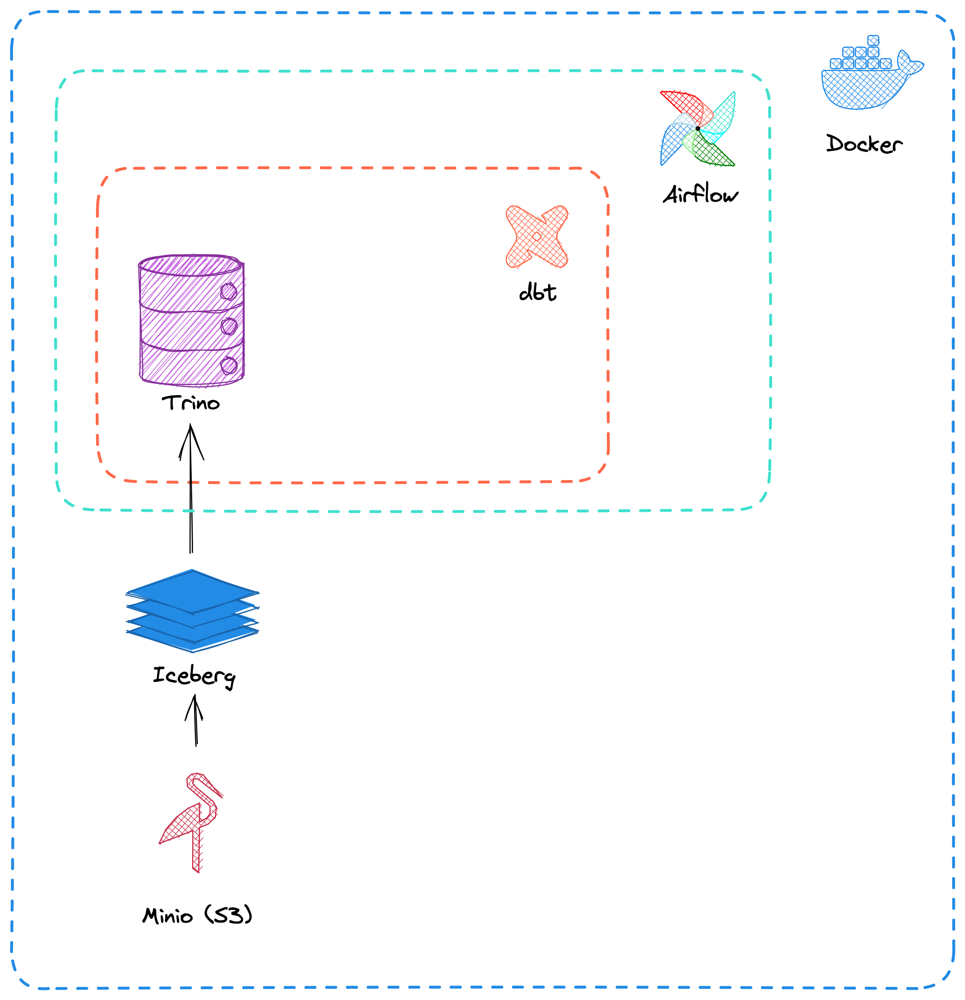

Proof of concept project for modern open-source data stack.

# Architecture

The project is focused on data transformation and not data ingestion.

- [Minio](https://github.com/minio/minio) serves as a place to store data.
- Data is stored using [Iceberg](https://github.com/apache/iceberg) format providing OLTP-style features for OLAP query engines.
- Data is queried using [Trino](https://github.com/trinodb/trino).
- [dbt](https://github.com/dbt-labs/dbt-core) is used to perform data transformation.
- [Airflow](https://github.com/apache/airflow) provides scheduling for running dbt data models.

The project is packaged using Docker.
